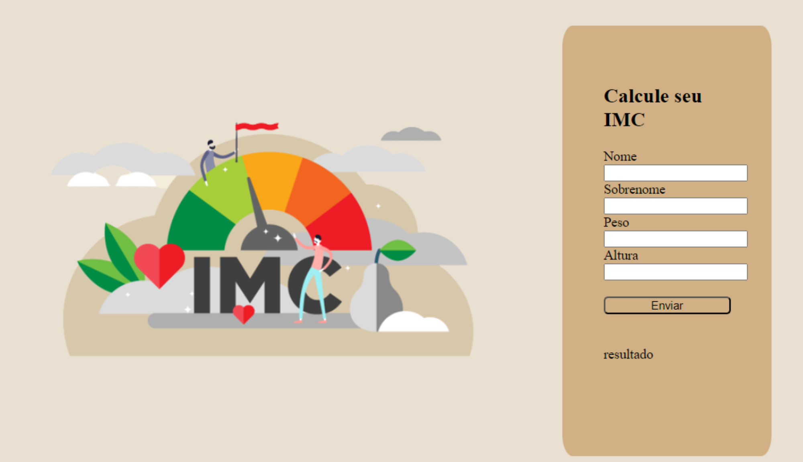

<h1 align="center"> IMC  </h1>

  <a href="#-tecnologias">Tecnologias</a>&nbsp;&nbsp;&nbsp;|&nbsp;&nbsp;&nbsp;
  <a href="#-projeto">Projeto</a>&nbsp;&nbsp;&nbsp;|&nbsp;&nbsp;&nbsp;

  

## 🚀 Tecnologias

Esse projeto foi desenvolvido com as seguintes tecnologias:

- HTML e CSS
- JavaScript
- Git e Github

## 💻 Projeto
Este projeto foi cuidadosamente desenvolvido para fornecer um cálculo preciso do Índice de Massa Corporal (IMC) de uma pessoa com base em sua altura e peso. Além disso, ele oferece a análise do resultado, indicando se a pessoa está dentro do peso saudável ou se está em um grau específico de obesidade. Uma ferramenta valiosa para promover a conscientização sobre a saúde e o bem-estar
  

                                         Feito com ♥ by Steffany Livino 
